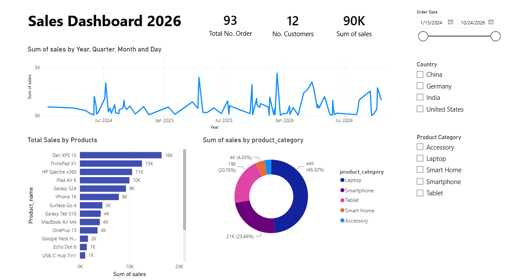

<div align="center">

# 📊 Power BI Customer Insights Dashboard


<br>


</div>

---
# 📸 Dashboard Preview

<p align="center">

</p>
---
---

# 📖 About The Project

This is my **first Power BI project**, created as part of my journey into **Business Intelligence** and **Data Analytics**.

The objective of this project was to transform raw customer and order data into meaningful business insights using **Power Query**, **DAX**, **Data Modeling**, and **Interactive Dashboards**.

Through this project, I learned the complete Power BI workflow—from importing data to creating professional dashboards.

---

# 🚀 Project Workflow

```text
Raw CSV Data
      │
      ▼
Import Dataset
      │
      ▼
Data Cleaning
      │
      ▼
Power Query
      │
      ▼
Data Modeling
      │
      ▼
DAX Calculations
      │
      ▼
Dashboard Development
      │
      ▼
Business Insights
```

---

# ✨ Features

- 📊 Interactive Dashboard
- 📈 KPI Cards
- 📉 Sales & Customer Analysis
- 📅 Dynamic Filters
- 📌 Slicers
- 📍 Business Insights
- 📦 Data Modeling
- 📐 DAX Calculations
- ⚡ Power Query Transformations

---

# 🧹 Data Cleaning

One of the main tasks in this project was cleaning the dataset before visualization.

### ✔ Missing Score Values

Some records contained blank values in the **Score** column.

To handle this, I created a new calculated column using **DAX**.

```DAX
Clean Score = COALESCE(customers[score], 0)
```

### 💡 Explanation

- If **Score** has a value → keep it.
- If **Score** is blank → replace it with **0**.

This ensured consistent and accurate analysis.

---

# ⚡ Power Query Transformations

Using **Power Query**, I performed several data transformation tasks.

### ✔ Created Full Name

Merged

- First Name
- Last Name

into a new column

```text
Full Name
```

This improved readability and dashboard presentation.

---

# 🔗 Data Modeling

Using **Model View**, I

- Created relationships between tables
- Connected Customers and Orders datasets
- Built an optimized relational model
- Improved report performance

---

## 📐 DAX (Data Analysis Expressions)

One of the key learnings in this project was creating calculated columns using **DAX** to clean and transform the data.

### 🔹 1. Handling Missing Score Values

To replace blank values in the **Score** column, I created the following calculated column:

```DAX
Clean Score = COALESCE(customers[score], 0)
```

### 💡 Explanation

- Returns the original **Score** if it exists.
- Replaces blank (`NULL`) values with **0**.
- Ensures accurate calculations and consistent visualizations.

---

### 🔹 2. Converting Text to Date Format

The **order_date** column was stored as **Text**, so I converted it into a proper **Date** data type using the following DAX formula:

```DAX
OrderDate =
DATE(
    VALUE(RIGHT([order_date],4)),
    VALUE(MID([order_date],4,2)),
    VALUE(LEFT([order_date],2))
)
```

### 💡 Explanation

This formula extracts the individual parts of the text date and reconstructs them as a valid **Date**.

For example:

| Original Text | Converted Date |
|--------------|----------------|
| `15/07/2024` | `15-Jul-2024` |
| `01/12/2023` | `01-Dec-2023` |

#### How it works

- `RIGHT([order_date],4)` → Extracts the **Year**
- `MID([order_date],4,2)` → Extracts the **Month**
- `LEFT([order_date],2)` → Extracts the **Day**
- `DATE()` → Combines Day, Month, and Year into a valid **Date** value recognized by Power BI.

---

### ✔ DAX Skills Learned

- Creating Calculated Columns
- Using `COALESCE()`
- Handling Missing Values
- Converting Text to Date
- Using `DATE()`
- Using `LEFT()`, `MID()`, and `RIGHT()`
- Data Transformation
- Preparing Data for Time-Based Analysis

---

# 📊 Dashboard Highlights

✔ Customer Insights

✔ Sales Analysis

✔ KPI Cards

✔ Order Analysis

✔ Interactive Charts

✔ Filters & Slicers

✔ Business Reports

---

# 🛠 Tech Stack

| Technology | Purpose |
|------------|---------|
| Power BI | Dashboard Development |
| Power Query | Data Transformation |
| DAX | Business Calculations |
| Model View | Table Relationships |
| CSV Files | Data Source |

---

# 🎯 Skills Learned

- Power BI
- Power Query
- DAX
- Data Cleaning
- Data Transformation
- Data Modeling
- Business Intelligence
- Dashboard Design
- KPI Tracking
- Interactive Reports
- Data Visualization

---

# 📂 Project Structure

```text
PowerBI-Customer-Dashboard
│
├── Dataset
│   ├── customers.csv
│   └── orders.csv
│
├── Dashboard.pbix
├── Dashboard.png
└── README.md
```

---

# 🌱 What I Learned

This project helped me understand:

✅ Importing CSV Data

✅ Data Cleaning

✅ Power Query

✅ Merging Columns

✅ Data Modeling

✅ Relationships

✅ DAX Calculations

✅ Dashboard Development

✅ Interactive Visualizations

✅ Business Intelligence

---

# 🚀 Future Improvements

- Advanced DAX
- Drill Through Reports
- Time Intelligence
- Bookmarks
- Parameters
- Row Level Security (RLS)
- Power BI Service
- Real-Time Dashboards

---

# 🤝 Connect With Me

<p align="center">

<a href="https://github.com/GeekySquid">

</a>

<a href="https://www.linkedin.com/in/rama-krishna-sahoo/">

</a>

</p>

---

<div align="center">

## ⭐ If you like this project, don't forget to Star this Repository!


</div>
